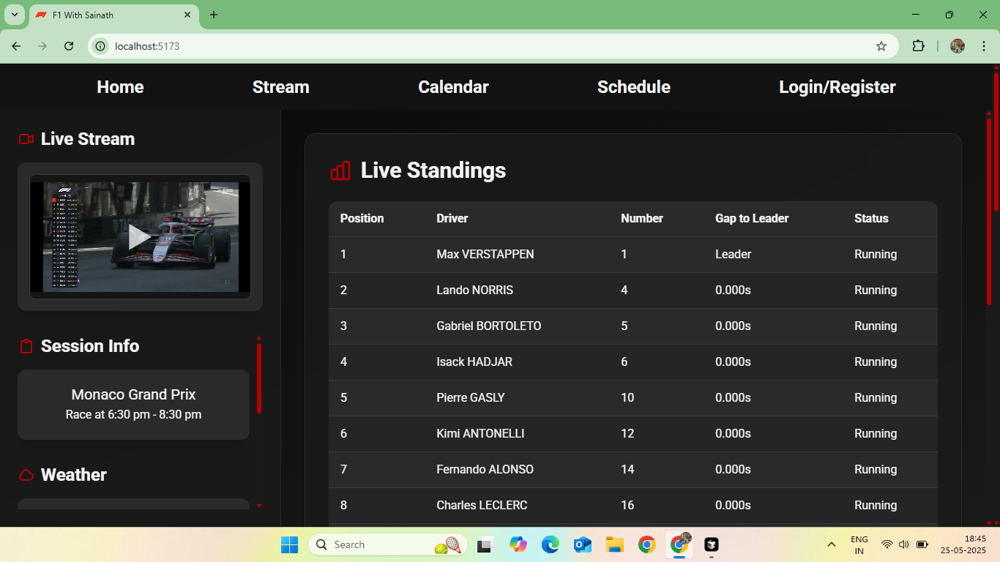
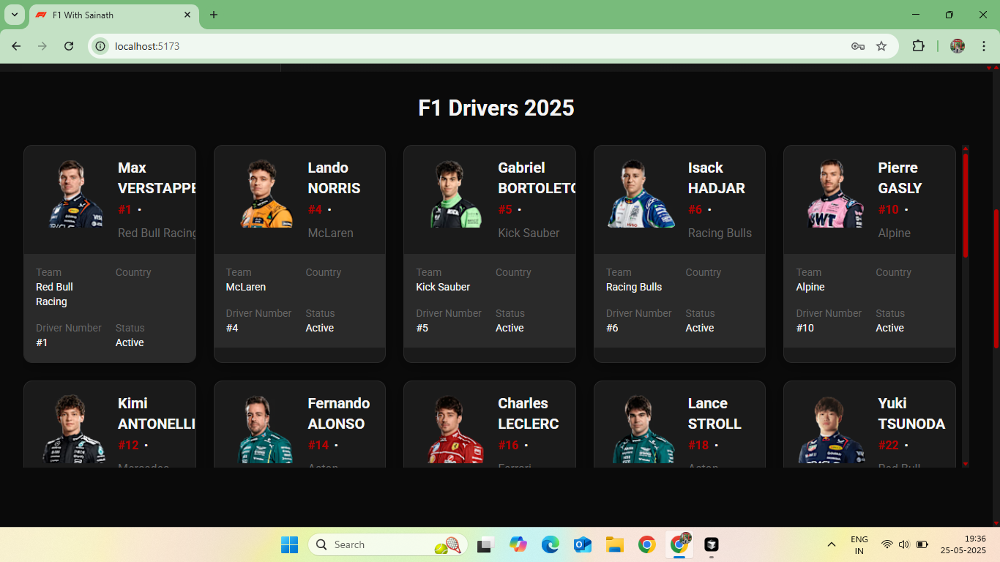
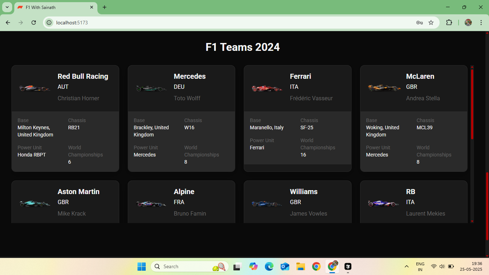
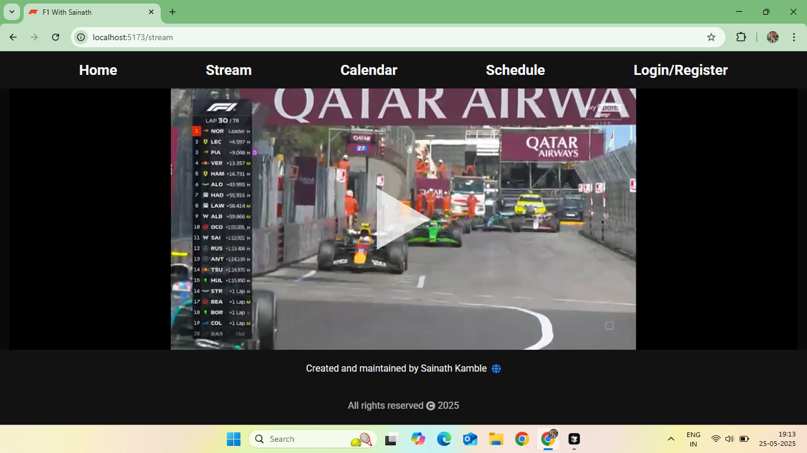
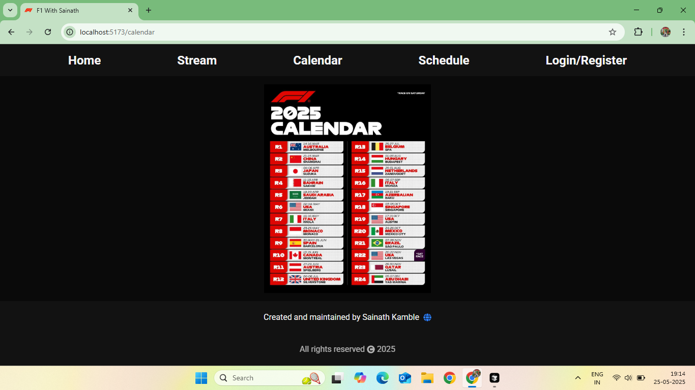
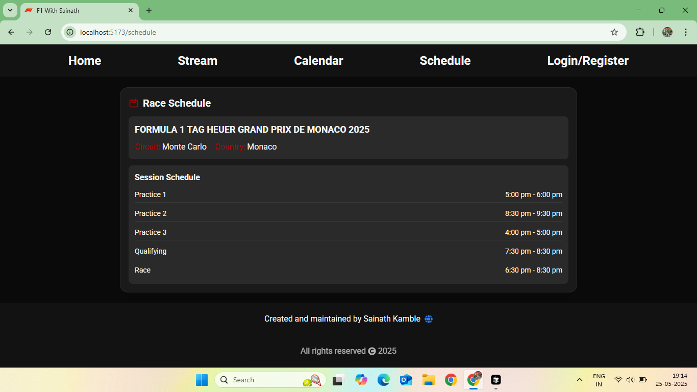
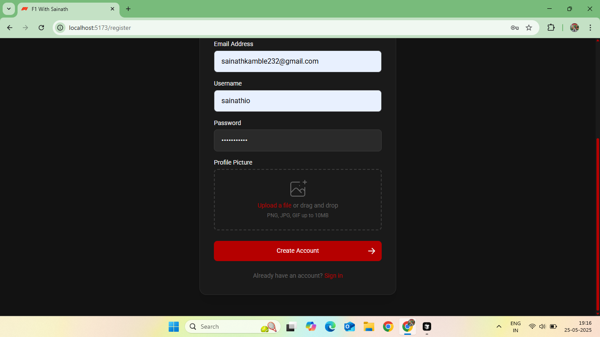
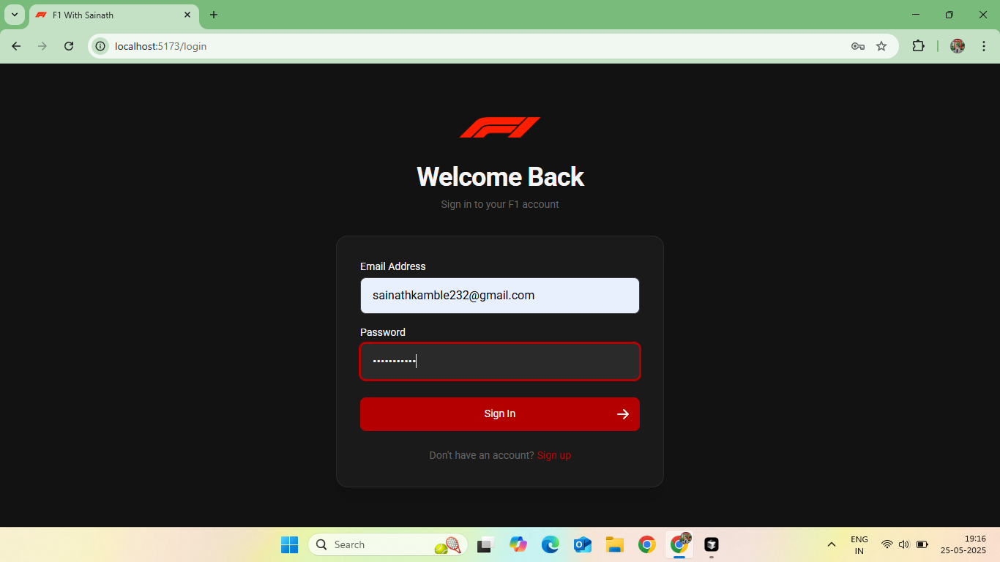
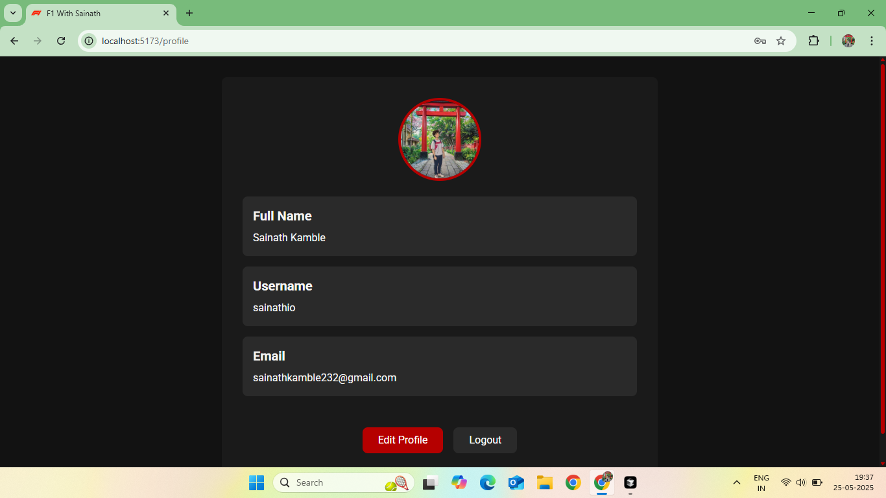
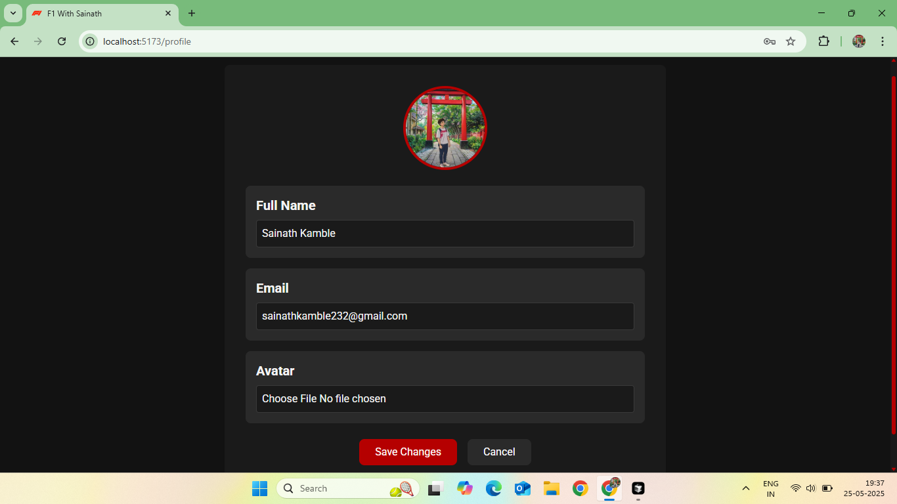

<h1>F1 by Sainath</h1>

This is Formula 1 streaming web app where you can watch all Formula 1 races live and also live data like weather details, race control and live driver standings etc.

<h3>1. Home Page</h3>
</img>

 

<h3>2. F1 Drivers</h3>
</img>

 

<h3>3. F1 Teams</h3>
</img>

 

<h3>4. Live Stream</h3>
</img>

 

<h3>5. F1 Calendar</h3>
</img>

 

<h3>6. Grand Prix Schedule</h3>
</img>

 

<h3>7. Register Page</h3>
</img>

 

<h3>8. Login Page</h3>
</img>

 

<h3>9. Profile Page</h3>
</img>

 

<h3>10. Edit Profile Page</h3>
</img>

